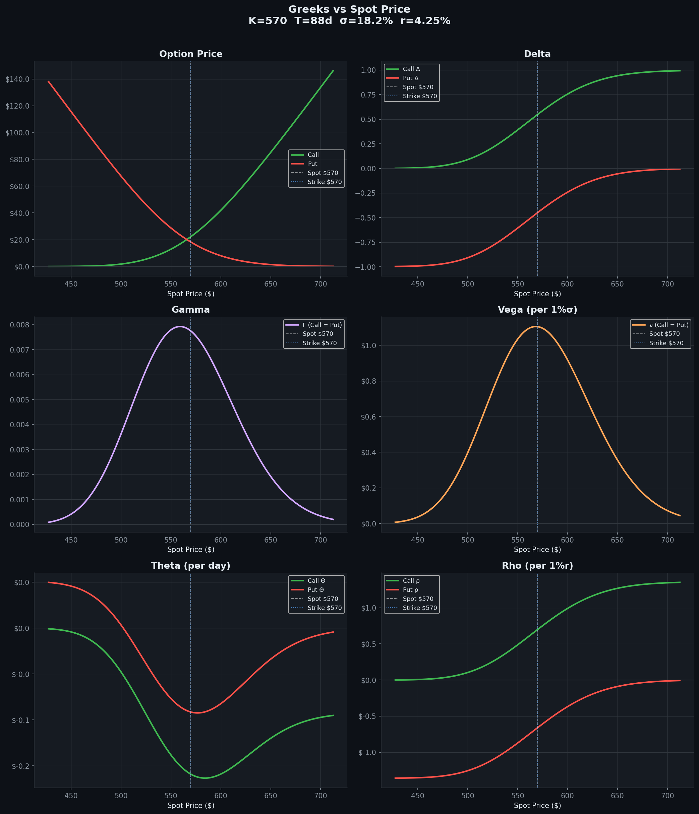
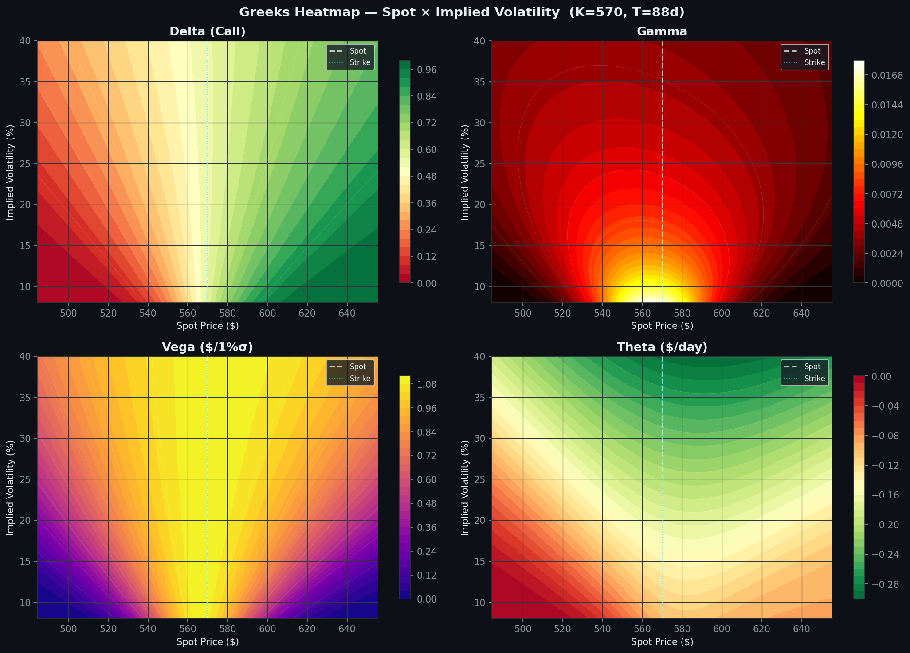
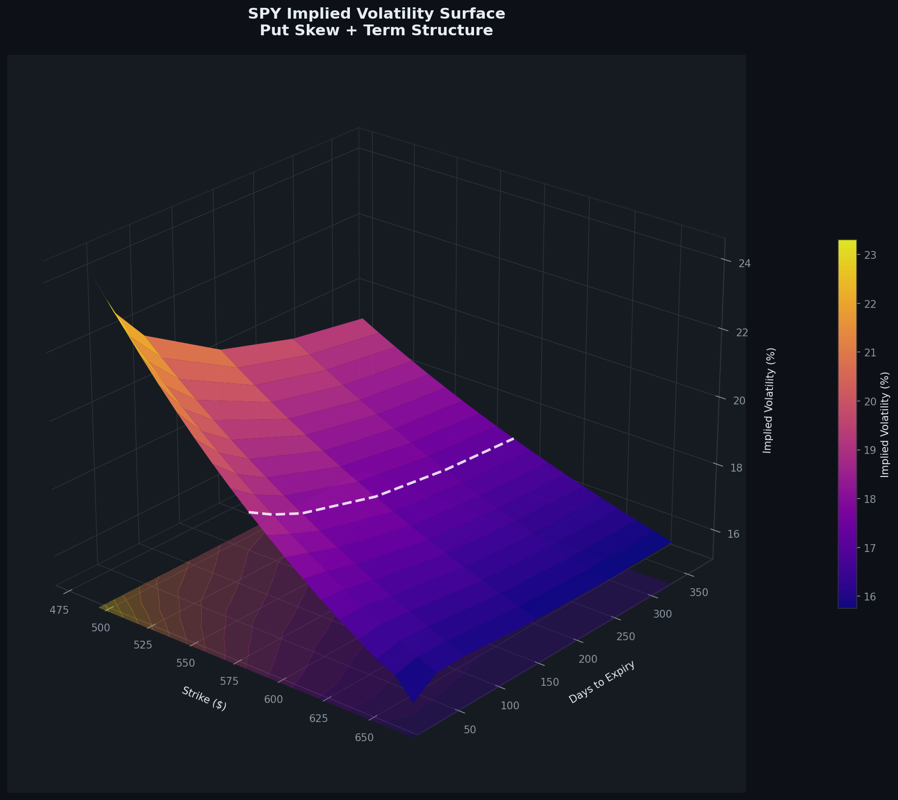
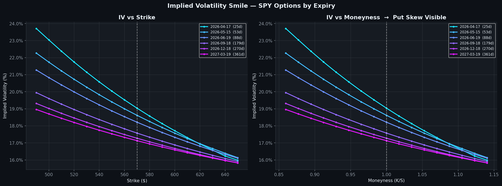
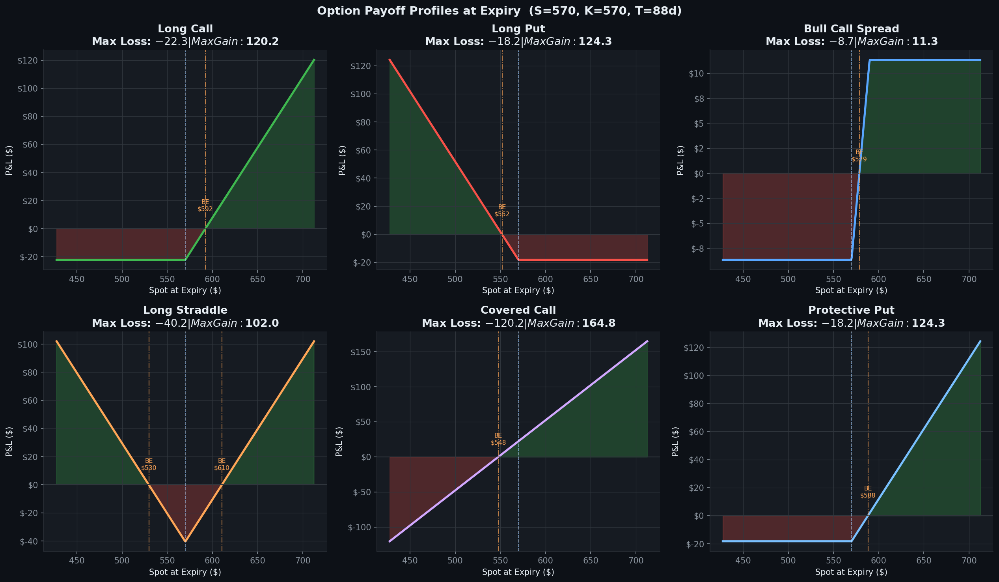
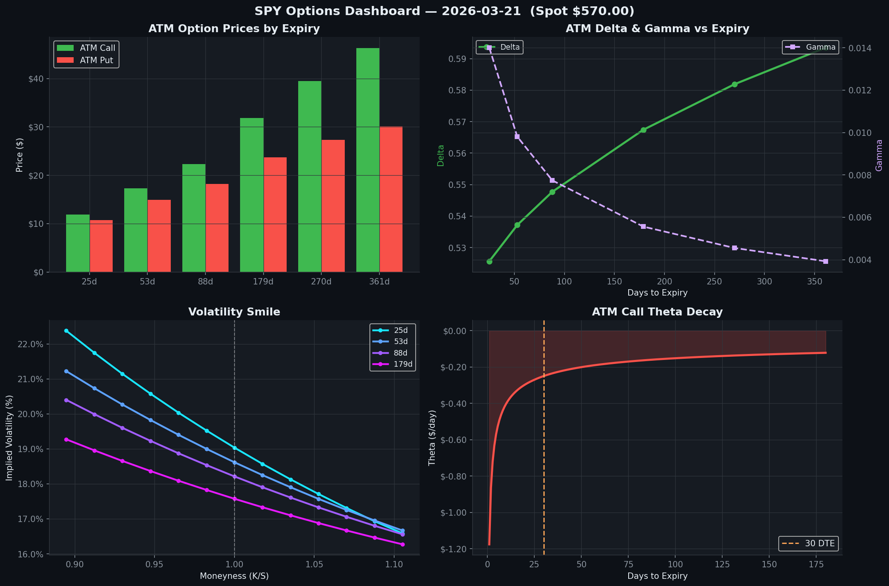

# Options Pricing — Black-Scholes, Greeks & Implied Volatility Surface

> **emlyon Business School — MiF 2025-2027**  
> SPY options chain · Yahoo Finance (yfinance) · March 2026

---

## Overview

Complete options pricing framework built from scratch in Python, applied to **SPY (S&P 500 ETF)** real market data from Yahoo Finance.

Covers the full quantitative workflow: model implementation → Greeks → implied vol extraction → 3D surface.

---

## Contents

| Section | Description |
|---|---|
| **1. Black-Scholes Model** | Call & Put pricing with continuous dividend yield (BSM) |
| **2. The Greeks** | Delta, Gamma, Vega, Theta, Rho — formulas & sensitivity analysis |
| **3. Greeks Heatmaps** | 2D sensitivity maps across Spot × Volatility |
| **4. Implied Volatility** | Newton-Raphson extraction from market prices |
| **5. Vol Surface (3D)** | Smile + term structure across 6 expiries |
| **6. Payoff Profiles** | Long Call/Put, Bull Spread, Straddle, Covered Call, Protective Put |

---

## Key Visuals

### Greeks vs Spot Price


### Greeks Heatmap (Spot × Implied Volatility)


### Implied Volatility Surface (3D)


> The **put skew** is clearly visible: OTM puts command a premium over OTM calls due to tail-risk demand. The **term structure** shows short-term vol premium that decays over time.

### Volatility Smile by Expiry


### Payoff Profiles


### Dashboard


---

## Black-Scholes Formulas

$$C = S e^{-qT} N(d_1) - K e^{-rT} N(d_2)$$
$$P = K e^{-rT} N(-d_2) - S e^{-qT} N(-d_1)$$

$$d_1 = \frac{\ln(S/K) + (r - q + \sigma^2/2)T}{\sigma\sqrt{T}}, \quad d_2 = d_1 - \sigma\sqrt{T}$$

| Greek | Call | Put | Interpretation |
|---|---|---|---|
| **Delta** Δ | $e^{-qT}N(d_1)$ | $-e^{-qT}N(-d_1)$ | Price sensitivity to spot move |
| **Gamma** Γ | $\frac{e^{-qT}N'(d_1)}{S\sigma\sqrt{T}}$ | = Call | Delta sensitivity to spot move |
| **Vega** ν | $S e^{-qT} N'(d_1)\sqrt{T}$ | = Call | Price sensitivity to volatility (+1%) |
| **Theta** Θ | (formula) | (formula) | Price sensitivity to time (per day) |
| **Rho** ρ | $KTe^{-rT}N(d_2)$ | $-KTe^{-rT}N(-d_2)$ | Price sensitivity to rate (+1%) |

---

## Data Source

```python
import yfinance as yf
spy = yf.Ticker("SPY")
chain = spy.option_chain("2026-06-19")  # choose expiry
```

The notebook automatically fetches live data from Yahoo Finance. If offline, it falls back to the pre-generated dataset in `data/spy_options_chain.csv`.

---

## Repository Structure

```
options-pricing/
├── README.md
├── requirements.txt
├── options_pricing.ipynb      # Main notebook
├── data/
│   ├── spy_options_chain.csv  # Pre-generated SPY options data (fallback)
│   └── market_snapshot.json   # Market parameters snapshot
└── charts/
    ├── 01_greeks_vs_spot.png
    ├── 02_greeks_vs_time.png
    ├── 03_greeks_heatmap.png
    ├── 04_vol_smile.png
    ├── 05_vol_surface_3d.png
    ├── 06_vol_surface_2d.png
    ├── 07_payoff_profiles.png
    └── 08_dashboard.png
```

---

## Installation

```bash
git clone https://github.com/your-username/options-pricing.git
cd options-pricing
pip install -r requirements.txt
jupyter notebook options_pricing.ipynb
```

## Requirements

```
numpy
pandas
scipy
matplotlib
yfinance
jupyter
```
